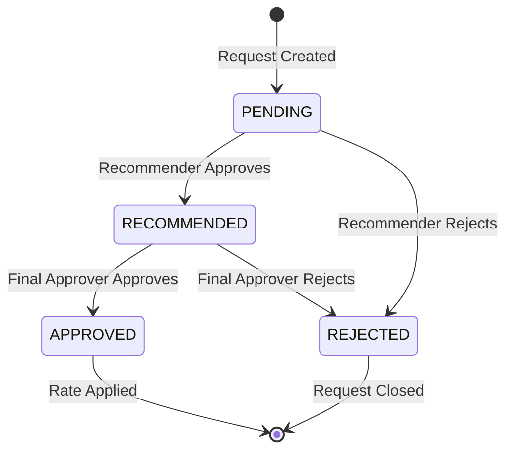

# Design Document: Lease Rate Management

## Overview

This design implements a comprehensive rate management system for leases, featuring automatic rate increases, long-term overrides, and a two-step approval workflow. The system integrates with the existing Prisma schema and Next.js application architecture.

## Architecture

The rate management system follows a layered architecture:

```text
┌─────────────────────────────────────────────────────────────┐
│                      UI Components                          │
│  (Rate Forms, Approval Lists, Rate History Display)         │
├─────────────────────────────────────────────────────────────┤
│                    Server Actions                           │
│  (rate-actions.ts, approval-actions.ts)                     │
├─────────────────────────────────────────────────────────────┤
│                    Prisma Models                            │
│  (RateChangeRequest, RateOverride, RateHistory)             │
├─────────────────────────────────────────────────────────────┤
│                    PostgreSQL Database                      │
└─────────────────────────────────────────────────────────────┘
```

## Components and Interfaces

### Server Actions

#### `lib/actions/rate-actions.ts`

```typescript
// Create rate change request
export async function createRateChangeRequest(data: {
  leaseUnitId: string
  proposedRate: number
  changeType: RateChangeType
  effectiveDate: Date
  reason: string
  requestedById: string
}): Promise<{ success: boolean; request?: RateChangeRequest; error?: string }>

// Create rate override request
export async function createRateOverride(data: {
  leaseUnitId: string
  overrideType: RateOverrideType
  fixedRate?: number
  percentageCap?: number
  effectiveFrom: Date
  effectiveTo?: Date
  reason: string
  requestedById: string
}): Promise<{ success: boolean; override?: RateOverride; error?: string }>

// Recommend rate change (first approval step)
export async function recommendRateChange(
  requestId: string,
  recommendedById: string,
  remarks?: string
): Promise<{ success: boolean; error?: string }>

// Final approve rate change (second approval step)
export async function approveRateChange(
  requestId: string,
  approvedById: string,
  remarks?: string
): Promise<{ success: boolean; error?: string }>

// Reject rate change (at any step)
export async function rejectRateChange(
  requestId: string,
  rejectedById: string,
  reason: string,
  step: ApprovalStep
): Promise<{ success: boolean; error?: string }>

// Apply approved rate change
export async function applyRateChange(
  requestId: string
): Promise<{ success: boolean; error?: string }>

// Get pending approvals for user
export async function getPendingApprovals(
  userId: string,
  approvalType: 'recommending' | 'final'
): Promise<RateChangeRequest[]>

// Get rate history for lease unit
export async function getRateHistory(
  leaseUnitId: string
): Promise<RateHistory[]>

// Check and apply scheduled rate increases (called by cron/manual trigger)
export async function processScheduledRateIncreases(): Promise<{
  processed: number
  errors: string[]
}>
```

### UI Components

#### Rate Change Request Form
- Location: `components/rate-management/rate-change-form.tsx`
- Props: `leaseUnitId`, `currentRate`, `onSuccess`
- Fields: proposedRate, effectiveDate, changeType, reason

#### Rate Override Form
- Location: `components/rate-management/rate-override-form.tsx`
- Props: `leaseUnitId`, `onSuccess`
- Fields: overrideType, fixedRate/percentageCap, effectiveFrom, effectiveTo, reason

#### Pending Approvals List
- Location: `components/rate-management/pending-approvals.tsx`
- Props: `userId`, `approvalType`
- Displays: List of pending requests with approve/reject actions

#### Rate History Display
- Location: `components/rate-management/rate-history.tsx`
- Props: `leaseUnitId`
- Displays: Chronological list of all rate changes

## Data Models

### Updated Lease Model
```prisma
model Lease {
  // ... existing fields
  standardIncreasePercentage Float?    @default(10)
  increaseIntervalYears      Int?      @default(3)
  nextScheduledIncrease      DateTime?
  autoIncreaseEnabled        Boolean   @default(true)
}
```

### Updated LeaseUnit Model
```prisma
model LeaseUnit {
  // ... existing fields
  baseRentAmount     Float?
  lastIncreaseDate   DateTime?
  rateOverrides      RateOverride[]
  rateChangeRequests RateChangeRequest[]
  rateHistory        RateHistory[]
}
```

### RateHistory Model
```prisma
model RateHistory {
  id            String         @id @default(cuid())
  leaseUnitId   String
  previousRate  Float
  newRate       Float
  changeType    RateChangeType
  effectiveDate DateTime
  reason        String?
  requestId     String?
  isAutoApplied Boolean        @default(false)
  createdAt     DateTime       @default(now())
  leaseUnit     LeaseUnit      @relation(...)
}
```

### RateOverride Model
```prisma
model RateOverride {
  id                   String            @id @default(cuid())
  leaseUnitId          String
  overrideType         RateOverrideType
  fixedRate            Float?
  percentageCap        Float?
  effectiveFrom        DateTime
  effectiveTo          DateTime?
  reason               String
  status               RateApprovalStatus @default(PENDING)
  requestedById        String
  requestedAt          DateTime          @default(now())
  recommendedById      String?
  recommendedAt        DateTime?
  recommendedRemarks   String?
  approvedById         String?
  approvedAt           DateTime?
  approvalRemarks      String?
  rejectedById         String?
  rejectedAt           DateTime?
  rejectedReason       String?
  rejectedAtStep       ApprovalStep?
  // ... relations
}
```

### RateChangeRequest Model
```prisma
model RateChangeRequest {
  id                   String            @id @default(cuid())
  leaseUnitId          String
  currentRate          Float
  proposedRate         Float
  changeType           RateChangeType
  effectiveDate        DateTime
  reason               String
  isFlagged            Boolean           @default(false)
  status               RateApprovalStatus @default(PENDING)
  requestedById        String
  requestedAt          DateTime          @default(now())
  recommendedById      String?
  recommendedAt        DateTime?
  recommendedRemarks   String?
  approvedById         String?
  approvedAt           DateTime?
  approvalRemarks      String?
  rejectedById         String?
  rejectedAt           DateTime?
  rejectedReason       String?
  rejectedAtStep       ApprovalStep?
  // ... relations
}
```

## Approval Workflow State Machine



## Auto-Increase Logic

```typescript
async function processScheduledRateIncreases() {
  // 1. Find all active leases where nextScheduledIncrease <= today
  const dueLeases = await prisma.lease.findMany({
    where: {
      status: 'ACTIVE',
      autoIncreaseEnabled: true,
      nextScheduledIncrease: { lte: new Date() }
    },
    include: { leaseUnits: true }
  })

  for (const lease of dueLeases) {
    for (const leaseUnit of lease.leaseUnits) {
      // 2. Check for active override
      const override = await getActiveOverride(leaseUnit.id)
      
      // 3. Calculate new rate based on override or standard increase
      const newRate = calculateNewRate(
        leaseUnit.rentAmount,
        lease.standardIncreasePercentage,
        override
      )

      // 4. Create flagged RateChangeRequest
      await createRateChangeRequest({
        leaseUnitId: leaseUnit.id,
        currentRate: leaseUnit.rentAmount,
        proposedRate: newRate,
        changeType: 'STANDARD_INCREASE',
        effectiveDate: new Date(),
        reason: `Scheduled ${lease.standardIncreasePercentage}% increase after ${lease.increaseIntervalYears} years`,
        isFlagged: true,
        status: 'AUTO_APPLIED'
      })

      // 5. Apply the rate change
      await applyRateToLeaseUnit(leaseUnit.id, newRate)

      // 6. Record in history
      await createRateHistory({
        leaseUnitId: leaseUnit.id,
        previousRate: leaseUnit.rentAmount,
        newRate,
        changeType: 'STANDARD_INCREASE',
        isAutoApplied: true
      })
    }

    // 7. Update next scheduled increase
    await updateNextScheduledIncrease(lease.id)
  }
}
```


## Correctness Properties

*A property is a characteristic or behavior that should hold true across all valid executions of a system—essentially, a formal statement about what the system should do. Properties serve as the bridge between human-readable specifications and machine-verifiable correctness guarantees.*

### Property 1: Base Rent Initialization
*For any* newly created lease with LeaseUnits, the `baseRentAmount` of each LeaseUnit SHALL equal its initial `rentAmount`.
**Validates: Requirements 1.1**

### Property 2: Next Scheduled Increase Calculation
*For any* newly created lease with `autoIncreaseEnabled = true`, the `nextScheduledIncrease` SHALL equal `startDate + increaseIntervalYears`.
**Validates: Requirements 1.2**

### Property 3: Rate Change Request Initial State
*For any* newly created RateChangeRequest, the status SHALL be PENDING and `requestedById` and `requestedAt` SHALL be populated.
**Validates: Requirements 2.3, 2.4**

### Property 4: Approval State Transitions
*For any* RateChangeRequest, the status transitions SHALL follow: PENDING → RECOMMENDED → APPROVED, with rejection possible at any step.
**Validates: Requirements 3.1, 3.2, 3.3, 3.4, 3.5**

### Property 5: Recommending Approval Records
*For any* RateChangeRequest that transitions from PENDING to RECOMMENDED, the `recommendedById` and `recommendedAt` fields SHALL be populated.
**Validates: Requirements 3.2**

### Property 6: Final Approval Records
*For any* RateChangeRequest that transitions from RECOMMENDED to APPROVED, the `approvedById` and `approvedAt` fields SHALL be populated.
**Validates: Requirements 3.4**

### Property 7: Rejection Records
*For any* RateChangeRequest that is rejected, the `rejectedById`, `rejectedAt`, `rejectedReason`, and `rejectedAtStep` fields SHALL be populated.
**Validates: Requirements 3.5**

### Property 8: Fixed Rate Override
*For any* LeaseUnit with an active FIXED_RATE override, rate calculations SHALL return the `fixedRate` value regardless of standard increase percentage.
**Validates: Requirements 4.2**

### Property 9: Percentage Cap Override
*For any* LeaseUnit with an active PERCENTAGE_CAP override, rate increases SHALL not exceed the `percentageCap` percentage.
**Validates: Requirements 4.3**

### Property 10: No Increase Override
*For any* LeaseUnit with an active NO_INCREASE override, the rate SHALL remain unchanged during the override period.
**Validates: Requirements 4.4**

### Property 11: Rate History Creation
*For any* rate change applied to a LeaseUnit, a RateHistory record SHALL be created with `previousRate`, `newRate`, `changeType`, and `effectiveDate`.
**Validates: Requirements 5.1**

### Property 12: Rate History Ordering
*For any* LeaseUnit, the rate history SHALL be retrievable in chronological order by `effectiveDate`.
**Validates: Requirements 5.4**

### Property 13: Auto-Applied Flag
*For any* rate change that is automatically applied (scheduled increase), the RateHistory record SHALL have `isAutoApplied = true`.
**Validates: Requirements 5.2**

## Error Handling

### Validation Errors
- Invalid rate values (negative, zero for rent)
- Invalid date ranges (effectiveTo before effectiveFrom)
- Missing required fields
- Invalid state transitions (e.g., approving a rejected request)

### Authorization Errors
- User without `isRecommendingApprover` attempting to recommend
- User without `isFinalApprover` attempting final approval
- User attempting to approve their own request

### Business Logic Errors
- Attempting to create override for non-existent LeaseUnit
- Attempting to apply rate change to terminated lease
- Conflicting active overrides for same LeaseUnit

## Testing Strategy

### Unit Tests
- Test rate calculation functions with various override scenarios
- Test date calculation for next scheduled increase
- Test state transition validation

### Property-Based Tests
- Use fast-check or similar library for TypeScript
- Minimum 100 iterations per property test
- Test rate calculations with random inputs
- Test approval workflow state machine

### Integration Tests
- Test full approval workflow end-to-end
- Test scheduled rate increase processing
- Test override application during rate increase
