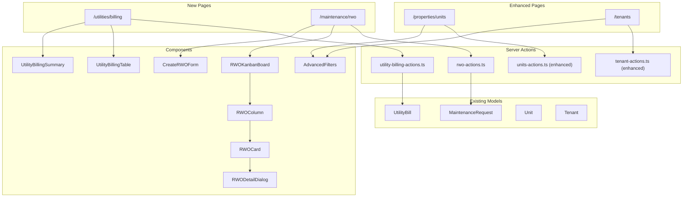

# Design Document: Property Monitoring Enhancements

## Overview

This design adds three major features to the property management system:
1. A dedicated Utilities Billing Monitoring page for tracking utility due dates
2. A Kanban-style RWO (Repair Work Order) board for maintenance management
3. Advanced filtering capabilities for spaces and tenants

The implementation follows Next.js App Router patterns with server actions, leverages existing Prisma models, and uses the established UI component library (shadcn/ui).

## Architecture



## Components and Interfaces

### 1. Utilities Billing Page Components

#### UtilityBillingPage (`app/(dashboard)/utilities/billing/page.tsx`)
```typescript
// Server component that fetches and displays utility billing data
interface UtilityBillingPageProps {
  searchParams: {
    property?: string
    utilityType?: string
    status?: 'all' | 'paid' | 'unpaid' | 'overdue'
    sortBy?: 'dueDate' | 'amount' | 'space'
    sortOrder?: 'asc' | 'desc'
  }
}
```

#### UtilityBillingSummary (`components/utilities/utility-billing-summary.tsx`)
```typescript
interface UtilityBillingSummaryProps {
  totalBills: number
  overdueCount: number
  upcomingCount: number // Due within 7 days
  totalAmountDue: number
  totalOverdueAmount: number
}
```

#### UtilityBillingTable (`components/utilities/utility-billing-table.tsx`)
```typescript
interface UtilityBillWithDetails {
  id: string
  dueDate: Date
  billingPeriodStart: Date
  billingPeriodEnd: Date
  amount: number
  isPaid: boolean
  paidDate: Date | null
  utilityType: 'ELECTRICITY' | 'WATER' | 'OTHERS'
  space: {
    id: string
    unitNumber: string
    property: {
      id: string
      propertyName: string
    }
  }
  tenant: {
    id: string
    businessName: string
    bpCode: string
  } | null
}

interface UtilityBillingTableProps {
  bills: UtilityBillWithDetails[]
  onRowClick: (bill: UtilityBillWithDetails) => void
}
```

#### UtilityBillingFilters (`components/utilities/utility-billing-filters.tsx`)
```typescript
interface UtilityBillingFiltersProps {
  properties: Array<{ id: string; propertyName: string }>
  currentFilters: {
    property?: string
    utilityType?: string
    status?: string
    sortBy?: string
    sortOrder?: string
  }
  onFilterChange: (filters: Record<string, string>) => void
}
```

### 2. RWO Kanban Board Components

#### RWOKanbanPage (`app/(dashboard)/maintenance/rwo/page.tsx`)
```typescript
// Server component that fetches maintenance requests and renders Kanban
interface RWOKanbanPageProps {
  searchParams: {
    property?: string
    priority?: string
    category?: string
  }
}
```

#### RWOKanbanBoard (`components/rwo/rwo-kanban-board.tsx`)
```typescript
interface RWOWithDetails {
  id: string
  category: MaintenanceCategory
  priority: Priority
  description: string
  status: MaintenanceStatus
  createdAt: Date
  completedAt: Date | null
  unit: {
    id: string
    unitNumber: string
    property: {
      id: string
      propertyName: string
    }
  }
  tenant: {
    id: string
    businessName: string
  }
  assignedTo: {
    id: string
    firstName: string
    lastName: string
  } | null
}

interface RWOKanbanBoardProps {
  requests: RWOWithDetails[]
  onStatusChange: (requestId: string, newStatus: MaintenanceStatus) => Promise<void>
}
```

#### RWOColumn (`components/rwo/rwo-column.tsx`)
```typescript
interface RWOColumnProps {
  status: MaintenanceStatus
  requests: RWOWithDetails[]
  isReceiving?: boolean
}
```

#### RWOCard (`components/rwo/rwo-card.tsx`)
```typescript
interface RWOCardProps {
  request: RWOWithDetails
  onClick: () => void
}

// Helper function for days elapsed
function getDaysElapsed(createdAt: Date): number {
  const now = new Date()
  const diffTime = Math.abs(now.getTime() - createdAt.getTime())
  return Math.ceil(diffTime / (1000 * 60 * 60 * 24))
}
```

#### RWODetailDialog (`components/rwo/rwo-detail-dialog.tsx`)
```typescript
interface RWODetailDialogProps {
  request: RWOWithDetails | null
  open: boolean
  onOpenChange: (open: boolean) => void
  onStatusChange: (newStatus: MaintenanceStatus) => Promise<void>
}
```

#### CreateRWODialog (`components/rwo/create-rwo-dialog.tsx`)
```typescript
interface CreateRWODialogProps {
  open: boolean
  onOpenChange: (open: boolean) => void
  spaces: Array<{
    id: string
    unitNumber: string
    propertyName: string
    tenantId?: string
  }>
  onSuccess: () => void
}
```

#### RWOSummary (`components/rwo/rwo-summary.tsx`)
```typescript
interface RWOSummaryProps {
  statusCounts: Record<MaintenanceStatus, number>
  priorityCounts: Record<Priority, number>
  totalOpen: number
}
```

### 3. Advanced Filter Components

#### SpaceRateFilter (`components/filters/space-rate-filter.tsx`)
```typescript
interface SpaceRateFilterProps {
  minRate?: number
  maxRate?: number
  sortBy?: 'rate' | 'name' | 'status'
  sortOrder?: 'asc' | 'desc'
  onFilterChange: (filters: {
    minRate?: number
    maxRate?: number
    sortBy?: string
    sortOrder?: string
  }) => void
}
```

#### TenantTenureFilter (`components/filters/tenant-tenure-filter.tsx`)
```typescript
interface TenantTenureFilterProps {
  tenureRange?: 'less-than-1' | '1-3' | '3-5' | '5-plus'
  sortBy?: 'tenure' | 'name' | 'status'
  sortOrder?: 'asc' | 'desc'
  onFilterChange: (filters: {
    tenureRange?: string
    sortBy?: string
    sortOrder?: string
  }) => void
}

// Helper function for tenure calculation
function calculateTenure(leaseStartDate: Date): { years: number; months: number } {
  const now = new Date()
  const diffTime = now.getTime() - leaseStartDate.getTime()
  const totalMonths = Math.floor(diffTime / (1000 * 60 * 60 * 24 * 30.44))
  return {
    years: Math.floor(totalMonths / 12),
    months: totalMonths % 12
  }
}

function formatTenure(tenure: { years: number; months: number }): string {
  if (tenure.years === 0) {
    return `${tenure.months} month${tenure.months !== 1 ? 's' : ''}`
  }
  if (tenure.months === 0) {
    return `${tenure.years} year${tenure.years !== 1 ? 's' : ''}`
  }
  return `${tenure.years}y ${tenure.months}m`
}
```

## Data Models

No schema changes required. The implementation uses existing Prisma models:

- `UtilityBill` - Already has `dueDate`, `billingPeriodStart`, `billingPeriodEnd`, `amount`, `isPaid`
- `MaintenanceRequest` - Already has `category`, `priority`, `status`, `description`, `assignedToId`
- `Unit` - Already has `totalRent` for rate filtering
- `Lease` - Already has `startDate` for tenure calculation

### Server Actions

#### utility-billing-actions.ts
```typescript
interface GetUtilityBillsParams {
  propertyId?: string
  utilityType?: UtilityType
  status?: 'all' | 'paid' | 'unpaid' | 'overdue'
  sortBy?: 'dueDate' | 'amount' | 'space'
  sortOrder?: 'asc' | 'desc'
}

async function getUtilityBills(params: GetUtilityBillsParams): Promise<{
  bills: UtilityBillWithDetails[]
  summary: UtilityBillingSummaryProps
}>

async function getUtilityBillingSummary(): Promise<UtilityBillingSummaryProps>
```

#### rwo-actions.ts
```typescript
interface GetRWOsParams {
  propertyId?: string
  priority?: Priority
  category?: MaintenanceCategory
}

async function getRWOs(params: GetRWOsParams): Promise<{
  requests: RWOWithDetails[]
  summary: RWOSummaryProps
}>

async function updateRWOStatus(
  requestId: string, 
  newStatus: MaintenanceStatus
): Promise<Result<RWOWithDetails, UpdateError>>

async function createRWO(data: {
  unitId: string
  category: MaintenanceCategory
  priority: Priority
  description: string
}): Promise<Result<RWOWithDetails, CreateError>>
```

#### Enhanced units-actions.ts
```typescript
interface GetUnitsParams {
  // Existing params...
  minRate?: number
  maxRate?: number
  sortBy?: 'rate' | 'name' | 'status' | 'area'
  sortOrder?: 'asc' | 'desc'
}
```

#### Enhanced tenant-actions.ts
```typescript
interface GetTenantsParams {
  // Existing params...
  tenureRange?: 'less-than-1' | '1-3' | '3-5' | '5-plus'
  sortBy?: 'tenure' | 'name' | 'status'
  sortOrder?: 'asc' | 'desc'
}

interface TenantWithTenure extends TenantWithDetails {
  tenure: { years: number; months: number }
  tenureFormatted: string
}
```

## Correctness Properties

*A property is a characteristic or behavior that should hold true across all valid executions of a system—essentially, a formal statement about what the system should do. Properties serve as the bridge between human-readable specifications and machine-verifiable correctness guarantees.*

### Property 1: Utility Bill Status Indicator Correctness

*For any* utility bill, the status indicator displayed SHALL be:
- "overdue" (red) if `dueDate < today AND isPaid === false`
- "warning" (yellow/orange) if `dueDate <= today + 7 days AND dueDate >= today AND isPaid === false`
- "paid" (green) if `isPaid === true`
- "normal" (default) otherwise

**Validates: Requirements 1.4, 1.5**

### Property 2: Utility Bills Grouping and Content

*For any* set of utility bills displayed on the billing page, each bill row SHALL contain:
- Due date
- Billing period (start and end dates)
- Amount
- Payment status
- Space number
- Property name
- Tenant name (if space has active lease)

And bills SHALL be grouped by space.

**Validates: Requirements 1.2, 1.3, 1.10**

### Property 3: Utility Billing Summary Calculations

*For any* set of utility bills, the summary SHALL correctly calculate:
- `totalBills` = count of all bills matching current filters
- `overdueCount` = count of bills where `dueDate < today AND isPaid === false`
- `totalAmountDue` = sum of `amount` for all unpaid bills

**Validates: Requirements 1.7**

### Property 4: Utility Bill Filtering

*For any* filter combination (property, utilityType, status), the displayed bills SHALL only include bills that match ALL active filter criteria.

**Validates: Requirements 1.6**

### Property 5: Utility Bill Sorting

*For any* sort configuration (sortBy, sortOrder), the displayed bills SHALL be ordered correctly:
- By dueDate: chronological order
- By amount: numerical order
- By space: alphabetical by unitNumber

**Validates: Requirements 1.9**

### Property 6: RWO Card Content

*For any* RWO displayed on the Kanban board, the card SHALL contain:
- Space number
- Property name
- Category
- Priority (with prominent indicator for EMERGENCY/HIGH)
- Description
- Assigned staff (if assigned)
- Creation date
- Days elapsed since creation

**Validates: Requirements 2.3, 2.4, 2.11, 2.12**

### Property 7: RWO Status Update

*For any* RWO status change operation, the maintenance request status in the database SHALL be updated to the new status, and the RWO SHALL appear in the correct Kanban column.

**Validates: Requirements 2.8**

### Property 8: RWO Creation Validation

*For any* RWO creation attempt, the system SHALL reject submissions that are missing:
- Space selection (unitId)
- Category
- Priority
- Description (non-empty)

**Validates: Requirements 2.6**

### Property 9: RWO Filtering

*For any* filter combination (property, priority, category), the displayed RWOs SHALL only include requests that match ALL active filter criteria.

**Validates: Requirements 2.9**

### Property 10: RWO Summary Calculations

*For any* set of RWOs, the summary SHALL correctly calculate:
- Status counts for each MaintenanceStatus
- Priority counts for each Priority level
- Total open = PENDING + ASSIGNED + IN_PROGRESS

**Validates: Requirements 2.13**

### Property 11: Space Rate Filtering and Sorting

*For any* rate filter (minRate, maxRate) and sort configuration:
- Filtered spaces SHALL have `totalRent >= minRate` (if set) AND `totalRent <= maxRate` (if set)
- When sorted by rate descending, the first space SHALL have the highest rate
- When sorted by rate ascending, the first space SHALL have the lowest rate

**Validates: Requirements 3.1, 3.2, 3.5**

### Property 12: Tenant Tenure Calculation and Filtering

*For any* tenant with active leases:
- Tenure SHALL be calculated from the earliest active lease start date
- Tenure SHALL be displayed in "Xy Zm" format (years and months)
- Tenure range filter SHALL correctly categorize:
  - "less-than-1": tenure < 12 months
  - "1-3": 12 <= tenure < 36 months
  - "3-5": 36 <= tenure < 60 months
  - "5-plus": tenure >= 60 months

**Validates: Requirements 4.1, 4.2, 4.3, 4.4, 4.5**

### Property 13: URL Filter State Synchronization

*For any* filter change:
- The URL query parameters SHALL be updated to reflect current filters
- Loading a URL with filter parameters SHALL apply those filters
- Multiple filters SHALL be combinable in the URL

**Validates: Requirements 5.1, 5.2, 5.4**

## Error Handling

Following the better-result pattern from the project skills:

```typescript
// Define TaggedErrors for domain errors
class NotFoundError extends TaggedError {
  readonly _tag = 'NotFoundError'
  constructor(public readonly entityType: string, public readonly id: string) {
    super(`${entityType} with id ${id} not found`)
  }
}

class ValidationError extends TaggedError {
  readonly _tag = 'ValidationError'
  constructor(public readonly field: string, public readonly message: string) {
    super(`Validation failed for ${field}: ${message}`)
  }
}

class UnauthorizedError extends TaggedError {
  readonly _tag = 'UnauthorizedError'
  constructor() {
    super('User is not authorized to perform this action')
  }
}

// Server actions return Result types
async function updateRWOStatus(
  requestId: string, 
  newStatus: MaintenanceStatus
): Promise<Result<RWOWithDetails, NotFoundError | UnauthorizedError>> {
  return Result.gen(async function* () {
    const session = yield* Result.await(getSession())
    if (!session?.user?.id) {
      return Result.err(new UnauthorizedError())
    }
    
    const request = yield* Result.await(findMaintenanceRequest(requestId))
    if (!request) {
      return Result.err(new NotFoundError('MaintenanceRequest', requestId))
    }
    
    const updated = yield* Result.await(prisma.maintenanceRequest.update({
      where: { id: requestId },
      data: { status: newStatus }
    }))
    
    return Result.ok(updated)
  })
}
```

## Testing Strategy

### Unit Tests

Unit tests will cover:
- Tenure calculation function (`calculateTenure`)
- Tenure formatting function (`formatTenure`)
- Bill status determination function (`getBillStatus`)
- Days elapsed calculation (`getDaysElapsed`)
- Filter URL serialization/deserialization

### Property-Based Tests

Using fast-check for property-based testing:

```typescript
import fc from 'fast-check'

// Property 1: Bill status indicator
describe('getBillStatus', () => {
  it('should return correct status for any bill', () => {
    fc.assert(
      fc.property(
        fc.record({
          dueDate: fc.date(),
          isPaid: fc.boolean()
        }),
        (bill) => {
          const status = getBillStatus(bill.dueDate, bill.isPaid)
          const today = new Date()
          const sevenDaysFromNow = new Date(today.getTime() + 7 * 24 * 60 * 60 * 1000)
          
          if (bill.isPaid) {
            expect(status).toBe('paid')
          } else if (bill.dueDate < today) {
            expect(status).toBe('overdue')
          } else if (bill.dueDate <= sevenDaysFromNow) {
            expect(status).toBe('warning')
          } else {
            expect(status).toBe('normal')
          }
        }
      ),
      { numRuns: 100 }
    )
  })
})

// Property 12: Tenure calculation
describe('calculateTenure', () => {
  it('should correctly calculate tenure for any start date', () => {
    fc.assert(
      fc.property(
        fc.date({ min: new Date('2000-01-01'), max: new Date() }),
        (startDate) => {
          const tenure = calculateTenure(startDate)
          const now = new Date()
          const expectedMonths = Math.floor(
            (now.getTime() - startDate.getTime()) / (1000 * 60 * 60 * 24 * 30.44)
          )
          
          expect(tenure.years * 12 + tenure.months).toBeCloseTo(expectedMonths, 0)
          expect(tenure.months).toBeGreaterThanOrEqual(0)
          expect(tenure.months).toBeLessThan(12)
        }
      ),
      { numRuns: 100 }
    )
  })
})

// Property 11: Rate filtering
describe('filterSpacesByRate', () => {
  it('should only include spaces within rate range', () => {
    fc.assert(
      fc.property(
        fc.array(fc.record({ id: fc.string(), totalRent: fc.float({ min: 0, max: 1000000 }) })),
        fc.float({ min: 0, max: 500000 }),
        fc.float({ min: 500000, max: 1000000 }),
        (spaces, minRate, maxRate) => {
          const filtered = filterSpacesByRate(spaces, minRate, maxRate)
          
          filtered.forEach(space => {
            expect(space.totalRent).toBeGreaterThanOrEqual(minRate)
            expect(space.totalRent).toBeLessThanOrEqual(maxRate)
          })
        }
      ),
      { numRuns: 100 }
    )
  })
})
```

### Integration Tests

Integration tests will verify:
- Server actions correctly query and return data
- Drag-and-drop status updates persist to database
- Filter combinations work correctly together
- URL state synchronization works bidirectionally
